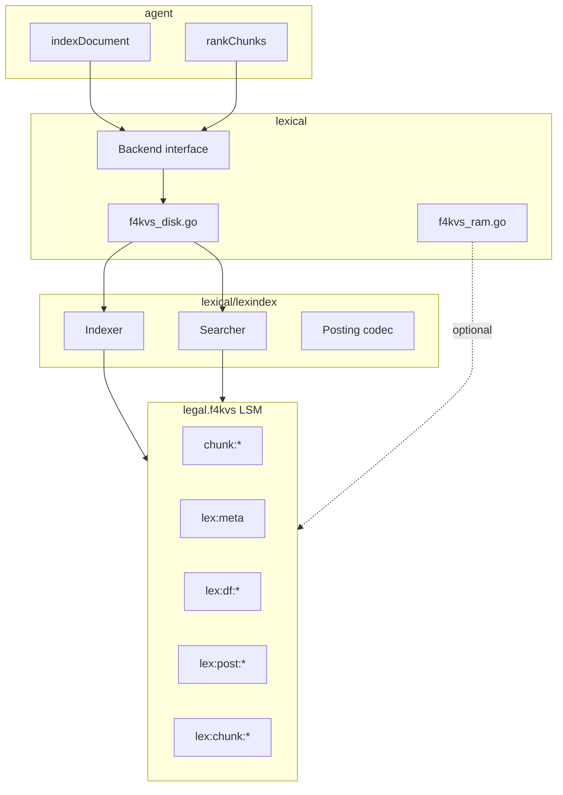

# On-disk lexical index over f4kvs — Implementation Plan

## 1. Problem

Today `RAG_LEXICAL_ENGINE=f4kvs` uses **`lexical/f4kvs_ram.go`**: BM25 statistics and posting-like data live **only in process memory**. Chunks are on disk in `legal.f4kvs/` (`chunk:*`), but every startup does a full `ScanPrefix("chunk:")` rebuild and every search scans **all** in-memory chunk records (O(n)).

At ~23k encyclopedia chunks this is acceptable locally; it does not scale to hundreds of thousands of chunks and wastes RAM.

**Goal:** Use the **same f4kvs LSM** (already open for chunks) to persist a **lexical inverted index** on disk, so that:

- Restart does not require a full RAM rebuild (optional fast rebuild for repair).
- Search touches **posting lists for query terms**, not every chunk.
- `lexical-engine=f4kvs` becomes a honest “single store” story: chunks + index in `legal.f4kvs/`.

**Non-goal:** Replace Bleve/Tantivy for users who want mature FTS. This is for operators who want **one data directory** and no second index library.

---

## 2. Design principles

| Principle | Choice |
|-----------|--------|
| Storage | Reuse existing `legal.f4kvs/` engine; **key prefixes**, not a second DB path |
| Layering | New **`lexindex`** module (inverted index logic) + thin **`lexical/f4kvs_disk.go`** `Backend` adapter |
| RAM path | Keep `f4kvs_ram.go` for tests and tiny corpora |
| Scoring | Reuse `lexical/bm25.go` (`ScoreChunkBM25`, same boosts as Bleve) |
| API surface | No change to `/ingest`, `/search`, `/retrieve` |
| Compatibility | Version byte in `lex:meta`; rebuild index if schema/version mismatch |

---

## 3. Architecture



### Module split

| Module | Responsibility |
|--------|----------------|
| **`lexical/lexindex`** | Key layout, encode/decode postings, DF/meta, index update, search over postings, rebuild-from-chunks |
| **`lexical/f4kvs_disk.go`** | Implements `lexical.Backend` by delegating to `lexindex` |
| **`lexical/f4kvs_ram.go`** | Unchanged MVP; used when `mode=ram` |
| **`lexical/kv.go`** | Small `KV` interface (Put/Get/Delete/ScanPrefix) so `lexindex` does not import `agent` |

`agent` passes the existing `chunkStore` (or raw `*f4kvs.Store`) into `lexical.Config.KV` when opening disk mode.

---

## 4. Key namespace (single f4kvs directory)

All keys live in the same store as chunks. Prefix design avoids scans of `chunk:*` during search.

| Key | Value | Purpose |
|-----|--------|---------|
| `lex:meta` | JSON/binary struct | Schema version, `N`, `AvgDL`, `chunk_count`, `built_at` |
| `lex:df:{term}` | `uint32` BE or varint | Document frequency (chunk-level: chunk contains term in any field) |
| `lex:post:{term}` | encoded posting list | Chunk IDs + per-field TF for that term |
| `lex:chunk:{chunk_id}` | encoded `LexChunkMeta` | Corpus, doc_id, field lengths (no raw text) |

**Do not** store full chunk text under `lex:*` — text stays in `chunk:{id}`.

Optional later:

| Key | Purpose |
|-----|---------|
| `lex:corpus:{name}` | Set of chunk IDs for fast corpus-only browse (v2) |
| `lex:doc:{doc_id}` | List of chunk IDs for doc delete (v2) |

### Term key normalization

Use the same tokenizer as RAM path: `lexical.Tokenize` (shared with ingest).

- Keys: `lex:df:` + lowercase term (UTF-8); cap term length (e.g. 64 bytes) to avoid huge keys.
- Skip terms with DF update only on index; ignore ultra-high-frequency noise list optional v2.

---

## 5. Encoded structures (v1)

### 5.1 `LexChunkMeta` (value at `lex:chunk:{id}`)

Compact blob (~50–200 bytes per chunk):

```text
chunk_id, doc_id, corpus (string table or inline)
length_text, length_title, length_doc_title, length_section (uint16)
```

Used at scoring time after candidates are collected from postings. **No per-term TF here** — TF for a term comes from the posting entry.

### 5.2 Posting list `lex:post:{term}`

Append-friendly v1 (simple, rebuild-friendly):

```text
[count: uint32]
repeat count times:
  chunk_id (len-prefixed string)
  corpus (len-prefixed string)
  tf_text, tf_title, tf_doc_title, tf_section (uint8 each, capped at 255)
```

**IndexChunk:** read-modify-write entire posting list for each term in chunk (acceptable for MVP ingest speed on 23k chunks; optimize in v2 with posting segments or LSM merge).

**v2 optimization:** `lex:post:{term}:{segment}` sharded by chunk_id hash; or delta-encoded runs.

### 5.3 `lex:meta`

```json
{
  "version": 1,
  "n": 23339,
  "avg_dl": 412.5,
  "chunk_count": 23339,
  "built_at": "2026-06-04T..."
}
```

---

## 6. Algorithms

### 6.1 `IndexChunk(chunk)`

1. `f := FieldsFromChunk(chunk)`; skip if no text.
2. Build in-memory `BM25Chunk` once (reuse `buildBM25Chunk`).
3. `Put lex:chunk:{id}` ← `LexChunkMeta`.
4. For each field and each distinct term in that field:
   - Load `lex:post:{term}`, append posting (or create).
   - Increment `lex:df:{term}` only if this chunk is **new** for that term (track per-chunk term set in memory during update, or rebuild df on compaction).
5. Update `lex:meta` (`N`, `AvgDL`) incrementally (same math as `BM25Global.registerChunk`).

**Re-ingest same chunk_id:** treat as **replace**: `DeleteChunk(chunk_id)` then index (requires agent doc-delete API — see §8).

### 6.2 `DeleteChunk(chunk_id)`

1. Load `lex:chunk:{id}` if missing, return.
2. Load posting lists for all terms in chunk (need term list stored on chunk — add `lex:terms:{chunk_id}` optional set, or scan all posts — too slow).

**MVP delete strategy:**

- Store `lex:terms:{chunk_id}` → JSON array of terms at index time.
- On delete: for each term, load posting list, remove entries for `chunk_id`, write back; decrement DF; update meta.

**v1 alternative (simpler):** no incremental delete; `DeleteChunk` marks tombstone in `lex:chunk:{id}`; search skips tombstones; background `lex:compact` rebuilds postings (defer).

### 6.3 `Search(text, corpus, k)`

1. `query := Tokenize(text)`; dedupe terms.
2. **Candidate collection:** for each query term, load `lex:post:{term}`; union chunk IDs (map[string]struct{}).
3. If no candidates, return nil.
4. Load `lex:meta` for global `N`, `AvgDL`.
5. For each candidate chunk_id (cap e.g. 10k before score):
   - Load `lex:chunk:{id}`; filter by `corpus` if set.
   - For each query term, get TF from that term’s posting entry for this chunk (or merge posting data into a temp `BM25Chunk`).
6. `ScoreChunkBM25` → top-k heap.
7. Return `[]Hit`.

Complexity: O(sum of posting lengths for query terms)) + O(candidates × |query|)), not O(all chunks).

### 6.4 `RebuildFromChunks(scan)`

Used when:

- `lex:meta` missing but `chunk:*` present.
- Version upgrade.
- `POST /reindex-lexical` admin endpoint (optional).

Steps:

1. Delete all keys with prefix `lex:` (ScanPrefix `lex:` + delete — add `Delete` to KV if missing, or rewrite store namespace).
2. Scan `chunk:*`, `IndexChunk` each (batch commit every N).
3. Log duration and counts (same as today’s RAM rebuild log).

If f4kvs has no Delete API yet, add `f4kvs_engine_delete` FFI wrapper or rebuild into new prefix `lex2:` and flip meta pointer.

---

## 7. Configuration

### 7.1 Engine modes

Keep one engine name `f4kvs`, add mode flag:

| Env / flag | Values | Default |
|------------|--------|---------|
| `RAG_F4KVS_LEXICAL_MODE` | `disk` \| `ram` | `disk` (after implementation; `ram` during transition) |
| `-f4kvs-lexical-mode` | same | |

`lexical.Open`:

```go
case EngineF4KVS:
    if cfg.F4KVSLexicalMode == "ram" {
        return openF4KVSRam(cfg)
    }
    return openF4KVSDisk(cfg)
```

### 7.2 Wiring in `agent`

```go
lexCfg := lexical.Config{
    DataDir: cfg.DataDir,
    Engine:  cfg.LexicalEngine,
    KV:      newLexicalKVAdapter(chunkStore), // Put/Get/ScanPrefix
    ScanChunks: ..., // still used for rebuild-on-start if meta missing
}
```

---

## 8. Dependencies on rag-agent (shared)

These benefit all engines but block **correct** memoir/encyclopedia updates:

| Item | Why |
|------|-----|
| `DELETE /documents/:doc_id` | Remove all chunks for doc from f4kvs + lexical index |
| `lexicalBackend.DeleteChunk` on doc replace | Already on interface; wire from delete |
| `lex:terms:{chunk_id}` or tombstone + compact | Correct incremental delete |

Document in living-memoirs plan; implement in rag-agent Phase 1.

---

## 9. FFI / KV extensions

Check `internal/f4kvs`:

| Capability | Needed for |
|------------|------------|
| `Put` / `Get` | Yes (have) |
| `ScanPrefix` | Rebuild, admin |
| **`Delete(key)`** | Remove posting entries, `lex:*` wipe |
| `BatchPut` (optional) | Ingest throughput |

If Delete is not in f4kvs-v2 FFI yet, add it upstream or implement **versioned index prefix** (`lex:v2:` full rebuild without per-key delete).

---

## 10. Performance targets

| Corpus | RAM (today) | Disk index (target) |
|--------|-------------|---------------------|
| 1k chunks | fine | comparable |
| 23k chunks | ~hundreds MB RSS | meta + postings on disk; RSS ∝ query candidate set |
| 500k chunks | impractical RAM | posting reads bounded by query terms |

**Ingest:** Expect slower than RAM index (RMW posting lists). Mitigate: batch rebuild at end of `ingest-dir` instead of per-chunk RMW (ingest flag `defer_lexical_commit=true`).

**Disk size (rough):** Similar order to Bleve for same text (inverted index overhead); measure on encyclopedia (23k chunks) — hypothesis 200–800 MB extra in `legal.f4kvs/` under `lex:*`.

---

## 11. Testing

| Test | Location |
|------|----------|
| Roundtrip index+search | `lexical/lexindex/index_test.go` with in-memory `mapKV` |
| Parity RAM vs disk | Same fixtures: top-1 hit agreement ≥ 90% on public gold |
| Rebuild from chunks | Delete `lex:meta`, reopen, assert search works |
| Corpus filter | `corpus=a` vs `b` |
| Encyclopedia scale (manual) | 23k chunks, latency p50 search < 100ms local |

CI: keep default `f4kvs` mode `ram` until disk stable; add job `f4kvs-disk` on public eval.

---

## 12. Implementation phases

### Phase 0 — KV adapter (1 day)

- `lexical/kv.go` — `KV` interface.
- `agent/lexical_kv.go` — wrap `ChunkStore`.
- Unit tests with `mapKV`.

### Phase 1 — `lexindex` core (3–5 days)

- Key codec, `LexChunkMeta`, posting list encode/decode.
- `Indexer.IndexChunk`, incremental meta/DF.
- `Searcher.Search` with BM25 scoring.
- `RebuildFromChunks`.

### Phase 2 — `f4kvs_disk` Backend (1 day)

- `openF4KVSDisk`, wire `lexical.Open`.
- Startup: if `lex:meta` missing → `RebuildFromChunks(ScanChunks)`.
- `Close()` no-op or flush meta.

### Phase 3 — Delete path (2–3 days)

- `lex:terms:{chunk_id}` index.
- `DeleteChunk` implementation.
- rag-agent `DELETE /documents/:doc_id` (if not done).

### Phase 4 — Ingest performance (2 days)

- Optional batch mode: accumulate chunks during dir ingest, single rebuild at end.
- Env `RAG_LEXICAL_BATCH=1`.

### Phase 5 — Docs + defaults (1 day)

- README: `f4kvs` disk vs ram, key layout, sizing.
- Default `RAG_F4KVS_LEXICAL_MODE=disk`.
- `compare_lexical_engines.sh` note.

**Total estimate:** ~2–3 weeks part-time.

---

## 13. Migration for existing deployments

1. Ship with default `mode=disk`.
2. On first start with new binary:
   - If `lex:meta` absent → auto `RebuildFromChunks` (one-time scan of `chunk:*`, log: `f4kvs lexical: built disk index over N chunks in Xs`).
3. No re-ingest of source files required.
4. Rollback: set `RAG_F4KVS_LEXICAL_MODE=ram`.

---

## 14. Alternatives considered

| Alternative | Rejected because |
|-------------|------------------|
| Second f4kvs path `legal.f4kvs.lexical/` | Two LSMs, double compaction; one prefix is simpler |
| Embed Bleve inside f4kvs engine | Defeats “single store” narrative; use `bleve` engine |
| Only snapshot RAM to `lex:snapshot` | Still O(n) search; only helps restart time |
| Postings in separate SQLite | Extra dependency; f4kvs already there |

---

## 15. Success criteria

- [ ] After rebuild, Recall@8 on `eval/gold/public.jsonl` with `f4kvs` disk ≥ Recall@8 with `f4kvs` ram (±0.05).
- [ ] Encyclopedia 23k chunks: process RSS stable across searches (no full chunk slice in memory).
- [ ] Restart without rebuild when `lex:meta` present (cold start < 5s index open).
- [ ] `lex:*` keys visible under `legal.f4kvs/`; `du -sh` reported in docs.
- [ ] `DeleteChunk` + doc delete removes chunk from search results.

---

## 16. Open questions

1. **f4kvs Delete API** — available in FFI? If not, priority upstream or prefix-rotate rebuild.
2. **Posting RMW at scale** — accept slow ingest v1 or require batch rebuild after ingest-dir?
3. **Engine naming** — keep `f4kvs` for disk and `f4kvs-ram` alias, or mode flag only?
4. **DF definition** — chunk-level (current RAM) vs document-level (Bleve-like)?

Recommendation: **chunk-level DF** (parity with current `f4kvs_ram.go`).

---

## Appendix — Example key sizes (one term)

```text
lex:df:revolution     → 4 bytes
lex:post:revolution   → [chunkA: tf_*][chunkB: tf_*]...
lex:chunk:doc-abc-chunk-0 → meta blob
```

## Appendix — File tree (target)

```text
lexical/
  kv.go                 # KV interface
  f4kvs_ram.go          # existing
  f4kvs_disk.go         # Backend → lexindex
  lexindex/
    meta.go
    posting.go
    indexer.go
    search.go
    rebuild.go
    codec.go
    kv_mem.go           # test double
    index_test.go
```
