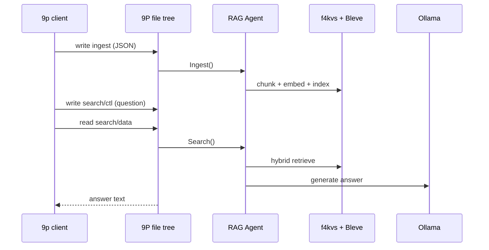

# P9

## 1. What you get

The agent exposes the same RAG pipeline as HTTP, but as a **9P2000 file tree**:

| Operation | HTTP | 9P |
|-----------|------|-----|
| Ingest document | `POST /ingest` | write JSON to `ingest` |
| Search (retrieve + LLM) | `GET /search` | write `search/ctl`, read `search/data` |
| Retrieve only | `GET /retrieve` | write `retrieve/ctl`, read `retrieve/data` |
| Stats | `GET /stats` | read `stats` |
| Reset index | `POST /reset` | write `reset` to `ctl` |
| Delete document | `DELETE /documents/:id` | create + remove under `documents/` (needs mount) |

Data lives under `-data-dir` (e.g. `~/rag-data/legal.f4kvs`, `~/rag-data/legal.bleve`).

---

## 2. Prerequisites

**Build the agent** (from repo root):

```bash
make f4kvs
make agent
```

**LLM backend** — default is Ollama on `http://localhost:11434`:

```bash
ollama serve          # if not already running
ollama pull qwen2.5:7b-instruct   # generation (/search answers)
ollama pull nomic-embed-text       # embeddings
```

Optional: `qwq` or other reasoning models for rewrite/HyDE experiments only — not recommended for user-facing `/search` streaming.

**plan9port** — provides `9p` (and optionally `9pfuse`):

```bash
# macOS
brew install plan9port

# verify
which 9p
```

**zsh:** always quote addresses with `!`:

```bash
'unix!/tmp/rag9p'
```

---

## 3. Start the agent (9P only)

```bash
./bin/agent -9p-addr 'unix!/tmp/rag9p' -addr off -data-dir ~/rag-data
```

Expected startup log (like yours):

```
LLM config: provider=ollama ...
lexical engine=bleve
data-dir=.../rag-data, ... http=off, 9p=unix!/tmp/rag9p
9p serving on unix!/tmp/rag9p
```

**HTTP + 9P together** (useful for bulk ingest via the Go client):

```bash
./bin/agent -9p-addr 'unix!/tmp/rag9p' -data-dir ~/rag-data
# HTTP on :8080 by default
```

**TCP instead of Unix socket:**

```bash
./bin/agent -9p-addr 'tcp!127.0.0.1!5640' -addr off -data-dir ~/rag-data
9p -a 'tcp!127.0.0.1!5640' read stats
```

---

## 4. Two ways to talk to the file tree

### A. `9p` CLI (no FUSE — recommended on macOS)

Each command is a separate connection (hence the EOF logs):

```bash
export RAG_9P='unix!/tmp/rag9p'

9p -a "$RAG_9P" read README
9p -a "$RAG_9P" read stats
9p -a "$RAG_9P" ls -l /
```

**Critical:** `9p write` reads payload from **stdin**, not from arguments:

```bash
echo 'hello' | 9p -a "$RAG_9P" write search/ctl   # correct
9p -a "$RAG_9P" write search/ctl 'hello'            # wrong (empty write)
```

### B. `9pfuse` mount (optional, needs macFUSE)

```bash
mkdir -p ~/ragmnt
9pfuse '/tmp/rag9p' ~/ragmnt
# or: 9pfuse 'unix!/tmp/rag9p' ~/ragmnt

cat ~/ragmnt/stats
echo 'What is article 1?' > ~/ragmnt/search/ctl
cat ~/ragmnt/search/data
```

Mount is nicer for `documents/` delete (see below). If FUSE is unavailable, use `9p` for everything else.

---

## 5. File tree layout

```
/
  README          usage text (read)
  stats           JSON manifest + ingest counters (read)
  ctl             write: reset | finalize | status
  ingest          write JSON document; read last result

  search/
    ctl           write your question (generation prompt)
    params        read/write retrieval options (key=value lines)
    data          read LLM answer (after ctl write)
    metadata      read JSON {prompt, model, provider, lang}

  retrieve/
    ctl           write retrieval query
    params        same format as search/params
    data          read RetrieveResponse JSON

  documents/
    <doc_id>      create file, then remove to delete (mount or 9p remove)
```

---

## 6. End-to-end walkthrough

### Step 0 — sanity check

```bash
9p -a 'unix!/tmp/rag9p' read ctl
# rag agent ready

9p -a 'unix!/tmp/rag9p' read stats
# JSON: documents_total, chunks_total, embedding_model, etc.
```

### Step 1 — fresh index (first run or re-index)

```bash
echo reset | 9p -a 'unix!/tmp/rag9p' write ctl
# read ctl → "index reset"
```

### Step 2 — ingest one document

Same JSON as `POST /ingest`:

```bash
jq -n \
  --arg id "constitution-art1" \
  --arg title "Article 1" \
  --arg content "# Article 1\n\nLa France est une République indivisible, laïque, démocratique et sociale." \
  '{id:$id, title:$title, content:$content, content_type:"markdown", corpus:"legal"}' \
| 9p -a 'unix!/tmp/rag9p' write ingest

9p -a 'unix!/tmp/rag9p' read ingest
# ok 1 chunks
```

**Ingest JSON fields:**

| Field | Required | Notes |
|-------|----------|-------|
| `id` | yes | Stable unique doc id |
| `title` | yes | Document title |
| `content` | yes | Markdown or HTML body |
| `content_type` | no | `markdown` (default) or `html` |
| `original_content` | no | Raw HTML for provenance |
| `corpus` | no | Tag for scoped search (`corpus=legal` in params) |

**HTML example:**

```bash
jq -n \
  --arg id "page-1" \
  --arg title "Page" \
  --arg html '<h1>Title</h1><p>Body text here with enough content to form at least one chunk.</p>' \
  '{id:$id, title:$title, content:$html, content_type:"html", original_content:$html, corpus:"web"}' \
| 9p -a 'unix!/tmp/rag9p' write ingest
```

### Step 3 — ingest a whole directory (shell loop)

There is no built-in “ingest-dir” over 9P. Use a loop:

```bash
#!/bin/sh
# rag-ingest-dir — ingest .md/.html under a folder via 9P
set -e
addr=${RAG_9P_ADDR:-unix!/tmp/rag9p}
dir=$1
corpus=${2:-}

[ -n "$dir" ] || { echo "usage: rag-ingest-dir <dir> [corpus]"; exit 1; }

find "$dir" -type f \( -name '*.md' -o -name '*.markdown' -o -name '*.html' -o -name '*.htm' \) | while read -r f; do
  rel=${f#"$dir"/}
  case "$f" in
    *.html|*.htm) ct=html; orig=$(cat "$f" | jq -Rs .) ;;
    *) ct=markdown; orig='""' ;;
  esac
  id=$(printf '%s' "$rel" | shasum -a 1 | awk '{print "doc-"$1}')
  title=$(basename "$f")
  content=$(cat "$f" | jq -Rs .)
  if [ -n "$corpus" ]; then
    json=$(jq -n --arg id "$id" --arg title "$title" --arg corpus "$corpus" \
      --argjson content "$content" --arg ct "$ct" \
      '{id:$id,title:$title,content:$content,content_type:$ct,corpus:$corpus}')
  else
    json=$(jq -n --arg id "$id" --arg title "$title" \
      --argjson content "$content" --arg ct "$ct" \
      '{id:$id,title:$title,content:$content,content_type:$ct}')
  fi
  printf '%s' "$json" | 9p -a "$addr" write ingest
  echo "ingested $rel"
done

echo finalize | 9p -a "$addr" write ctl   # optional legacy step
9p -a "$addr" read stats
```

**Practical alternative:** keep HTTP for bulk ingest, 9P for queries:

```bash
# terminal 1: agent with both transports
./bin/agent -9p-addr 'unix!/tmp/rag9p' -data-dir ~/rag-data

# terminal 2: bulk ingest via Go client
go run ./client -mode ingest-dir -dir ./docs -corpus mylibrary -server http://localhost:8080
```

### Step 4 — retrieve (no LLM, inspect ranked chunks)

```bash
printf 'article 1 république\n' | 9p -a 'unix!/tmp/rag9p' write retrieve/ctl
9p -a 'unix!/tmp/rag9p' read retrieve/data
```

Response shape:

```json
{
  "status": "ok",
  "query": "article 1 république",
  "hits": [
    {
      "chunk_id": "...",
      "doc_id": "constitution-art1",
      "score": 0.82,
      "corpus": "legal",
      "section": "Article 1",
      "doc_title": "Article 1"
    }
  ]
}
```

### Step 5 — search (retrieve + LLM answer)

```bash
printf 'Qu’est-ce que l’article 1 dit sur la République ?\n' \
  | 9p -a 'unix!/tmp/rag9p' write search/ctl

9p -a 'unix!/tmp/rag9p' read search/data      # plain-text answer
9p -a 'unix!/tmp/rag9p' read search/metadata  # prompt, model, provider, lang
```

Or use the helper scripts:

```bash
chmod +x scripts/plan9/rag-search scripts/plan9/rag-retrieve
export RAG_9P_ADDR='unix!/tmp/rag9p'

./scripts/plan9/rag-retrieve 'article 1 république'
./scripts/plan9/rag-search 'Qu’est-ce que l’article 1 dit ?'
```

---

## 7. Retrieval parameters (`search/params` or `retrieve/params`)

One `key=value` per line (comments with `#`):

```
corpus=legal
top_k=8
bm25_k=20
vector_k=20
fusion=0.6
fusion=rrf
min_score=0.2
lang=fr
rq=shorter BM25 query
doc_id=constitution-art1
```

| Key | Meaning |
|-----|---------|
| `corpus` | Filter to docs ingested with that corpus tag |
| `top_k` | Final number of chunks sent to LLM |
| `bm25_k` / `vector_k` | Candidate pool sizes |
| `fusion` | `0.6` (weighted) or `rrf` |
| `min_score` | Skip LLM if best hybrid score is below this |
| `lang` | Force answer language (`en`, `fr`) |
| `rq` / `retrieval_q` | Separate retrieval query from the generation prompt |

**Example — long instruction for LLM, short query for BM25:**

```bash
printf 'corpus=legal\ntop_k=6\nrq=article 1 république\nlang=fr\n' \
  | 9p -a 'unix!/tmp/rag9p' write search/params

printf 'À partir des extraits uniquement, résume l’article 1 en 3 points.\n' \
  | 9p -a 'unix!/tmp/rag9p' write search/ctl

9p -a 'unix!/tmp/rag9p' read search/data
```

Params persist per area (`search/` vs `retrieve/`) until overwritten.

---

## 8. Admin & maintenance

```bash
# Wipe Bleve + f4kvs (then re-ingest)
echo reset | 9p -a 'unix!/tmp/rag9p' write ctl

# Legacy IDF finalize (optional; hybrid search does not depend on it)
echo finalize | 9p -a 'unix!/tmp/rag9p' write ctl

# Status
9p -a 'unix!/tmp/rag9p' read ctl
```

**Check index health:**

```bash
9p -a 'unix!/tmp/rag9p' read stats | jq '.ingest, .manifest, .warnings'
```

---

## 9. Delete a document

Requires a **mounted** tree (`9pfuse`):

```bash
# doc must exist in the index; name = doc id
touch ~/ragmnt/documents/constitution-art1
rm ~/ragmnt/documents/constitution-art1
```

`9p` has no `remove` subcommand — use HTTP `DELETE` or remount workflow if you stay CLI-only.

---

## 10. Multiple shelves (separate indexes)

One process + one socket + one data dir per corpus shelf:

```bash
./bin/agent -9p-addr 'unix!/tmp/rag-legal'  -addr off -data-dir ~/.rag-agents/legal
./bin/agent -9p-addr 'unix!/tmp/rag-domain' -addr off -data-dir ~/.rag-agents/domain
```

Point clients with `RAG_9P_ADDR` or `-a`.

---

## 11. Troubleshooting

| Symptom | Cause / fix |
|---------|-------------|
| `9p session error: EOF` on every command | **Normal** — `9p` disconnects after each op |
| `write a query to search/ctl first` | You read `search/data` before writing `search/ctl` |
| Empty search answer | No docs ingested, or `min_score` too high — try `retrieve/data` first |
| `no_results` / low scores | Run `reset`, re-ingest; check `corpus` matches ingest tag |
| Embedding failures in `stats` | Ollama down or model missing — `ollama pull nomic-embed-text` |
| `cannot find load_fusefs` | Install macFUSE or use `9p` CLI instead |
| zsh eats `!` in addresses | Quote: `'unix!/tmp/rag9p'` |
| Slow first search | First LLM call loads model; embeddings computed at ingest |

**Minimal smoke test after ingest:**

```bash
addr='unix!/tmp/rag9p'

9p -a "$addr" read stats | jq '.ingest.documents_total'
printf 'test query\n' | 9p -a "$addr" write retrieve/ctl
9p -a "$addr" read retrieve/data | jq '.status, (.hits|length)'
```

---

## 12. Mental model



---

Your startup command is the right one. Next step: ingest at least one document, then run `./scripts/plan9/rag-retrieve 'your terms'` before `rag-search` so you can confirm retrieval works before involving the LLM.

If you want this saved as `docs/plan9-tutorial.md` in the repo, say the word and I’ll add it.