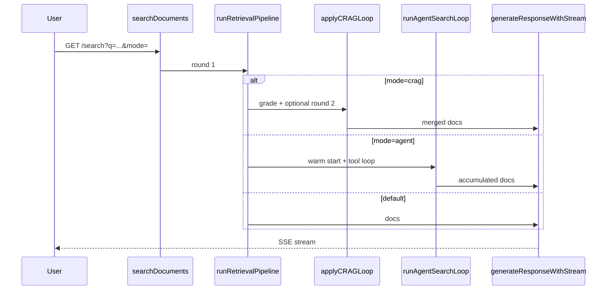

# Agentic RAG

Evolution from linear retrieve → prompt → answer toward LLM-driven retrieval loops.

## Pattern choice

| Tier | Pattern | When | API |
|------|---------|------|-----|
| 0 (default) | Linear RAG | Fast path, simple queries | `GET /search?q=...` |
| 1 | Corrective RAG (CRAG) | Multi-article legal, partial first-pass recall | `GET /search?q=...&crag=1` or `mode=crag` |
| 2 | Tool agent | Multi-hop KB, exploratory queries | `GET /search?q=...&mode=agent` |

**Decision:** start with CRAG (tier 1) because it reuses the existing hybrid pipeline without tool-calling support requirements. Promote to the tool agent (tier 2) when CRAG baseline eval shows recall gaps on multi-hop gold cases.

Self-RAG (reflection tokens) is deferred: local 7B models calibrate poorly on structured reflection, and CRAG covers the main “re-retrieve when context is weak” use case with fewer moving parts.

## Tier 1 — CRAG

After the first `runRetrievalPipeline` pass:

1. `completeLLM` grades excerpts (relevant / off-topic / gap).
2. If insufficient → up to 2 follow-up keyword queries → second retrieval pass.
3. Merge and dedupe chunks by `chunk_id`, then run the existing generation prompt.

Limits: `crag_max_rounds` query param (default 2, max 2).

## Tier 2 — Tool agent

ReAct-style loop (text actions, no native tool-calling required):

| Tool | Maps to |
|------|---------|
| `search_kb` | `runRetrievalPipeline` with explicit query |
| `get_chunk` | `loadChunkByID` |
| `finish` | Stop retrieving, proceed to generation |

Warm-starts with one standard retrieval pass. SSE events: `retrieval_round`, `tool_call`, `tool_result`.

Limits: 5 iterations, 3 retrieval calls max.

## Baseline evaluation

Before comparing agentic modes, measure single-pass retrieval:

```bash
./scripts/eval_agentic_baseline.sh http://127.0.0.1:8080
```

Gold sets:

- `eval/gold/legal.jsonl` — Constitution multi-article cases
- `eval/gold/multihop.jsonl` — eval-public cases requiring multiple documents

Compare CRAG / agent modes with generation eval when Ollama is available:

```bash
go run ./client -mode eval-generation -server http://127.0.0.1:8080 \
  -gold eval/gold/legal.jsonl \
  -search-mode crag
```

## Architecture



## Related files

| Path | Role |
|------|------|
| `agent/crag.go` | CRAG grading, follow-up queries, merge |
| `agent/agent_loop.go` | Tool-agent orchestration |
| `agent/agent_tools.go` | Tool execution handlers |
| `agent/search_mode.go` | `mode`, `crag`, `crag_max_rounds` parsing |
| `eval/gold/multihop.jsonl` | Multi-doc retrieval gold |
| `scripts/eval_agentic_baseline.sh` | Baseline report script |
