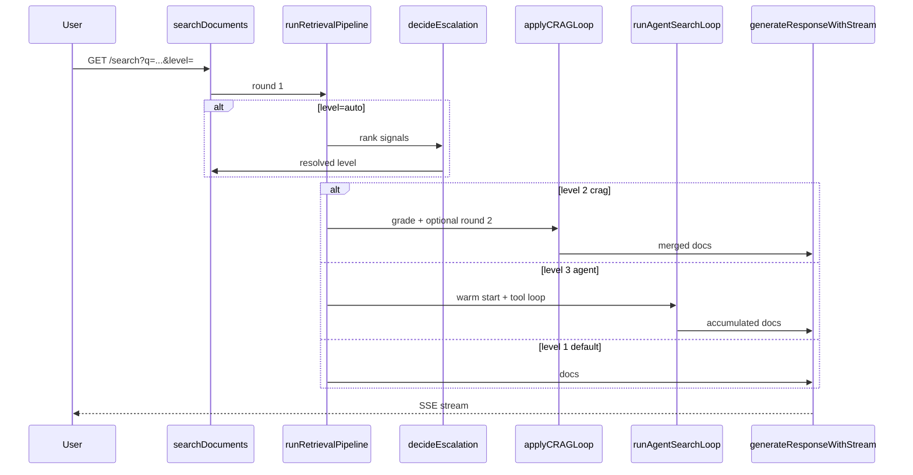

# Agentic RAG

Evolution from retrieve-only → linear RAG → corrective retrieval → tool agent, with optional auto-escalation.

## Search levels

| Level | Pattern | When | API |
|-------|---------|------|-----|
| 0 | Retrieve only | Debug, retrieval eval | `GET /retrieve?q=...` |
| 1 (default) | Linear RAG | Fast path, strong single-doc hits | `GET /search?q=...` or `level=1` |
| 2 | Corrective RAG (CRAG) | Weak or dispersed first-pass recall | `level=2`, `crag=1`, or `mode=crag` |
| 3 | Tool agent | Multi-hop, comparative queries | `level=3` or `mode=agent` |
| auto | Auto-escalation | Opt-in routing after first retrieve | `level=auto` |

**Default:** level 1 (linear RAG). Use `level=auto` to let the server pick the cheapest sufficient tier.

Self-RAG (reflection tokens) is deferred: local 7B models calibrate poorly on structured reflection, and CRAG covers the main “re-retrieve when context is weak” use case with fewer moving parts.

## Level auto — escalation heuristics

After the first `runRetrievalPipeline` pass, cheap heuristics (no LLM) choose the tier:

1. **Jump to agent (level 3)** — multi-hop / comparative query (checked first):
   - comparative patterns (`compare`, `versus`, `différence entre`, …)
   - or ≥ 2 distinct docs in top-k plus multi-aspect query (`… and … and …`)
   - reason: `multihop_query`
   - overrides single-doc guard — a `Compare X and Y` query must not stay linear even when one doc scores high

2. **Stay linear (level 1)** — single-doc guard:
   - top score ≥ 0.85 and ≥ 2/3 of top-3 hits share the same `doc_id`
   - reason: `single_doc_high_confidence`

3. **Escalate to CRAG (level 2)** — weak or dispersed retrieval:
   - top score < 0.55, or ≥ 3 distinct docs with no dominant doc
   - reason: `weak_or_dispersed`

4. **Default linear (level 1)** — reason: `default_linear`

Post-CRAG: if auto resolved to level 2, CRAG grades insufficient, and the query had multihop signals → bump to agent (`post_crag_multihop`).

Tuning query params (optional):

- `auto_min_linear_score` (default `0.85`)
- `auto_crag_score` (default `0.55`)
- `auto_dominant_fraction` (default `0.67`)

SSE event `escalation` is emitted with `{resolved_level, reason, top_score, dominant_doc_id, unique_docs}`.
Response metadata includes `search_level`, `search_level_requested`, `escalation_reason`.

Examples:

```bash
# Encyclopedia single-topic — expect level 1
curl -N 'http://127.0.0.1:8081/search?level=auto&corpus=kb-encyclopedias&rq=French+Revolution+1789&q=Quelles+étaient+les+causes+de+la+Révolution+française+en+1789?'

# Multi-hop eval-public — expect level 2 or 3
curl -N 'http://127.0.0.1:8081/search?level=auto&corpus=eval-public&q=How+does+hybrid+retrieval+combine+BM25+and+vectors,+and+which+metrics+grade+retrieval+quality?'
```

`level=0` on `/search` returns HTTP 400; use `/retrieve` instead.

## Level 2 — CRAG

After the first `runRetrievalPipeline` pass:

1. `completeLLM` grades excerpts (relevant / off-topic / gap).
2. If insufficient → up to 2 follow-up keyword queries → second retrieval pass.
3. Merge and dedupe chunks by `chunk_id`, then run the existing generation prompt.

Limits: `crag_max_rounds` query param (default 2, max 2).

## Level 3 — Tool agent

ReAct-style loop (text actions, no native tool-calling required):

| Tool | Maps to |
|------|---------|
| `search_kb` | `runRetrievalPipeline` with explicit query |
| `get_chunk` | `loadChunkByID` |
| `finish` | Stop retrieving, proceed to generation |

Warm-starts with one standard retrieval pass. SSE events: `escalation`, `retrieval_round`, `tool_call`, `tool_result`.

Limits: 5 iterations, 3 retrieval calls max.

## Baseline evaluation

Before comparing agentic modes, measure single-pass retrieval:

```bash
./scripts/eval_agentic_baseline.sh http://127.0.0.1:8080
```

Gold sets:

- `eval/gold/legal.jsonl` — Constitution multi-article cases
- `eval/gold/multihop.jsonl` — eval-public cases requiring multiple documents

Compare modes with generation eval when Ollama is available:

```bash
go run ./client -mode eval-generation -server http://127.0.0.1:8080 \
  -gold eval/gold/legal.jsonl \
  -search-mode crag
```

Report auto-escalation routing (parses SSE metadata):

```bash
go run ./client -mode eval-escalation -server http://127.0.0.1:8080 \
  -gold eval/gold/multihop.jsonl
```

## Architecture



## Related files

| Path | Role |
|------|------|
| `agent/search_escalation.go` | Auto-escalation heuristics |
| `agent/crag.go` | CRAG grading, follow-up queries, merge |
| `agent/agent_loop.go` | Search orchestration, tool-agent loop |
| `agent/agent_tools.go` | Tool execution handlers |
| `agent/search_mode.go` | `level`, `mode`, `crag`, tuning params |
| `eval/gold/multihop.jsonl` | Multi-doc retrieval gold |
| `client/eval_escalation.go` | Auto-routing eval report |
| `scripts/eval_agentic_baseline.sh` | Baseline report script |
